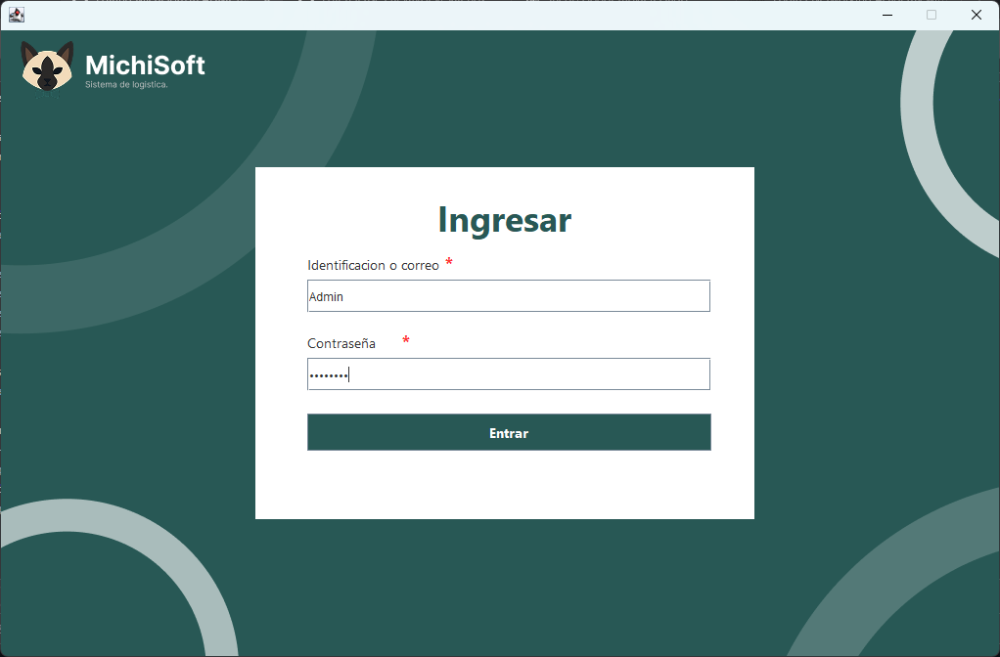

# 😺 MichiSoft
Un programa básico especializado en la gestión de inventarios y administración de productos. Además, los administradores tienen la función de gestionar los usuarios que colaboran en el sistema y pueden realizar tareas de apoyo en la administración.

Actualmente, este programa está desarrollado en Java y funciona únicamente de forma local, ya que fue creado como parte de un proyecto académico para un parcial de programación.

El sistema está diseñado bajo el modelo MVP (Model–View–Presenter), lo que permite un mayor control del código, una mejor organización y la posibilidad de hacerlo más escalable en futuras versiones.

>[!IMPORTANT]
>Este codigo tiene una licensia ``MIT``
<p align="center">
 
 
 

  
## 👥 Integrantes
  - Roberto Jimenez (Full-Stack, Arquitecto MVP)
  - Samul Castro (DBA / Data Engineer, Back-End)
  - Alejandra Bolvar (Developer, Tester / QA)
  - Esteban Jaimez (Developer)
    
> Michisoft Studios - 2025 (Universidad)
## 📷 Capturas
<p align="center">

  
<details>
<summary> 👮‍♂️ Vista Admin</summary>
<p align="center">
  
| Panel Administrativo|Panel de registros |
|---------------------|-------------------|
|  |  | 
| Panel de Sucursales | Panel de piezas |
|  |  |

</p>

</details> 

<details>
<summary> 🏪 Vista Vendedor</summary>
<p align="center">
  
| Panel de Registros | Panel del inventario |
|---------------------|-------------------|
|  |  | 
 | Panel del equipo | Panel de resumenes |
|  |  |

</p>

</details> 

## 💾 Instalacion
>[!WARNING]
>Se recomienda utilizar el entorno de desarrollo NetBeans, ya que este programa fue desarrollado originalmente en dicha plataforma.

 1 Deberás clonar este repositorio. (Lo siguiente es hacerlo desde tu terminal de Git.)
   ```Bash
   git clone https://github.com/RevayDev/MichiSoft.git
   ```
   ¿No tienes Git? https://git-scm.com/
   
 2 Disfruta aprendiendo :D
 
## 📂 Estructura del proyecto

```bash
NetBeansProjects/MichiSoft/src/main/
├── java
│   ├── com
│   │   └── michiStudios
│   │       ├── Factures
│   │       │   ├── Factura_1.txt
│   │       │   ├── Factura_2.txt
│   │       │   └── Factura_3.txt
│   │       └── michisoft
│   │           ├── database
│   │           │   ├── DataBase.java
│   │           │   ├── FileManage
│   │           │   │   ├── DuplicateChecker.java
│   │           │   │   ├── Loader.java
│   │           │   │   ├── MainFileManager.java
│   │           │   │   ├── Parser.java
│   │           │   │   ├── Registro.txt
│   │           │   │   └── Saver.java
│   │           │   └── preData.java
│   │           ├── Main.java <------------------------------ Ejecutador principal
│   │           ├── Model
│   │           │   ├── loginModel.java
│   │           │   ├── panelAdminModel.java
│   │           │   ├── panelRegistroVModel.java
│   │           │   └── panelVendedorModel.java
│   │           ├── Precenter
│   │           │   ├── loginPrecenter.java
│   │           │   ├── panelAdminPrecenter.java
│   │           │   └── panelVendedorPrecenter.java
│   │           └── View
│   │               ├── loginView.form
│   │               ├── loginView.java
│   │               ├── messageView.java
│   │               ├── panelAdminView.java
│   │               ├── panelVendedorView.java
│   │               └── Seccions
│   │                   ├── PanelAdmin
│   │                   │   ├── PanelPiezaControllers.java
│   │                   │   ├── PanelReportes.java
│   │                   │   ├── PanelSucursales.java
│   │                   │   └── PanelUsers.java
│   │                   └── PanelVendedor
│   │                       ├── panelEquipo.java
│   │                       ├── panelInventario.java
│   │                       ├── panelRegisterVenta.java
│   │                       └── panelResumen.java
│   └── Sound_Manage
│       ├── CorrectSound.java
│       ├── ErrorSound.java
│       └── Sounds_Player.java
└── resources
    ├── images
    │   ├── Decoration1.png
    │   ├── Decoration2.png
    │   ├── Decoration3.png
    │   ├── Decoration4.png
    │   ├── Icons
    │   │   ├── config.png
    │   │   ├── edificio-de-oficinas.png
    │   │   ├── Exit.png
    │   │   ├── rompecabezas.png
    │   │   └── User.png
    │   └── Logo+Text.png
    └── Sounds
        ├── MB-ErrorSound.wav
        └── TLZ-Correct.wav


```
